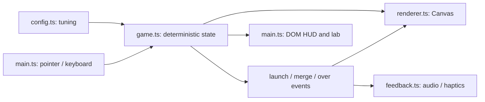

# Orbit

A playable vertical prototype of a minimalist orbital puzzle. The experiment: **are launching, anticipating a collision, and chaining merges fun enough to repeat?**

## Run

Use Node 22.12+ (or a newer supported LTS release).

```sh
npm ci
npm run dev
```

Open http://localhost:5173. For a phone on the same network, use the network URL printed by Vite. Audio unlocks on the first interaction. Browser haptics are best-effort and are not available on every mobile browser.

```sh
npm test             # deterministic simulation tests
npm run build        # typecheck and production bundle
npm run check        # all core checks
npx playwright install chromium  # first time only
npm run test:browser # browser integration checks
```

## Play

Hold the central planet, drag outward to choose an orbit and insertion angle, then release. The illuminated ring and ghost object show the capture point. The dotted clockwise arc shows the launch boost's additional travel relative to resting objects. Drag back toward the planet to cancel.

- Inner rings rotate faster. Resting objects on a ring share the same base speed.
- Launches receive a temporary boost. Matching neighbors merge into the next integer: 1 + 1 → 2; 2 + 2 → 3.
- Different numbers block overtaking. The boosted object queues behind them. Launch just behind the object you want to reach.
- Merges renew the boost, allowing the result to catch another match. A chain multiplier follows that object's lineage and expires after a short window.
- Each ring has a soft safe capacity. Filling a ring adds visual tension. Exceeding the total safe capacity for the full grace period ends the run; a timely merge can rescue it.
- Restart repeats the seed's launch sequence. Best score stays in this browser when storage is available.

Keyboard: focus the board with Tab; ↑/↓ choose orbit, ←/→ adjust angle, Space or Enter launch. R restarts. Escape cancels aiming.

## Tune

All gameplay values live in [src/config.ts](src/config.ts). Ring count derives from the `rings` array; starting objects must reference valid rings. Canvas dimensions use a 640 × 640 logical board. Keep the largest radius below 285 and leave enough separation for readable objects.

Press **D**, hold the Orbit wordmark, or use `?debug` to open the tuning lab. It exposes pause, fixed-step advance, simulation speed, number/ring/angle selection, spawn, clear orbit, merge pair, capacity, angle, actual speed, seed, and draw timing. P toggles pause while the lab is open. `?seed=42` reproduces a run.

Draw timing is CPU time submitting one frame, not GPU time. The simulation caps catch-up after long frames and pauses while the tab is hidden; it never replays missed background time.

## Architecture



`Game` owns objects, circular movement, collision queues, spawn distribution, scoring, combos, and failure. It has no DOM or audio dependencies. `main.ts` drives it at 120 fixed steps per simulation second. The seeded generator and stable collision ordering make runs reproducible for the same input steps. This is a deliberately small rules/presentation split; an ECS, physics engine, and component framework would add overhead to this experiment.

`Renderer` draws a cached procedural planet, orbital trails, particles, merge ripples/pop, score labels, and small screen feedback. Reduced-motion preferences remove decorative pop, particles, and shake. `Feedback` synthesizes short tones with Web Audio and accepts a replaceable `Haptics` implementation. Replace the latter with a native bridge if we later package the web build with [Capacitor](https://capacitorjs.com/docs). Build tooling uses [Vite](https://vite.dev/guide/).

There are no accounts, backend, menus, progression systems, or assets requiring an external image pipeline. The optional Google font falls back to the system font offline.

## What to evaluate next

Play the same screen for 10–20 minutes before expanding it. Ask whether the target and boost are predictable, whether incompatible blocking is legible, whether chains feel earned, and whether losing makes you want to restart. Tune boost duration/speed, ring capacity, grace, and spawn weights first.

The collision and presentation rules are intentionally provisional. This implementation does not establish the success criterion by itself. Native packaging, device audio/haptics verification, and longer performance profiling remain future milestones.

The pre-implementation decisions and phased scope are recorded in [docs/PLAN.md](docs/PLAN.md).
