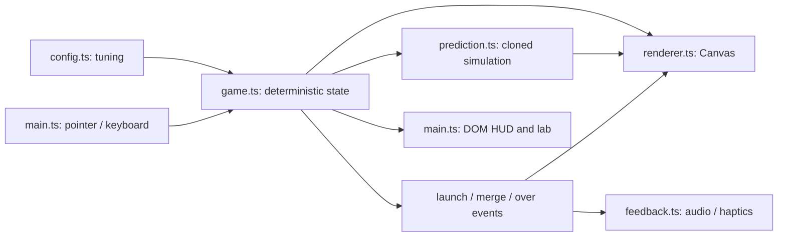

# Orbit

A playable orbital puzzle, now at the planning milestone (v0.2). The experiment: **do anticipating a collision, reserving a number, and setting up chains create a loop worth repeating?**

## Run

Use Node 22.12+ (or a newer supported LTS release).

```sh
npm ci
npm run dev
```

Open http://localhost:5173. For a phone on the same network, use the network URL printed by Vite. Audio unlocks on the first interaction. Browser haptics are best-effort and are not available on every mobile browser.

```sh
npm test             # deterministic simulation tests
npm run build        # typecheck and production bundle
npm run check        # all core checks
npx playwright install chromium  # first time only
npm run test:browser # browser integration checks
npm run test:pages   # production build at /orbit/, then browser smoke checks
```

## GitHub Pages

The workflow in [.github/workflows/ci.yml](.github/workflows/ci.yml) checks every push and pull request. On `main`, successful checks are followed by a Pages build and deployment. It can also be run manually from Actions on `main`.

1. In the GitHub repository, open **Settings → Pages → Build and deployment → Source** and select **GitHub Actions**.
2. Push the workflow and application changes to `main`.
3. Open the **Check and deploy** workflow run. The `deploy-pages` job publishes the site and records its URL in the `github-pages` environment.

For this repository, the default URL will be https://michael-baker-us.github.io/orbit/ after the first successful deployment. The build reads the base path from `actions/configure-pages`, so a repository rename, user site, or configured custom domain uses its actual Pages path. Vite's normal local development path remains `/`. No personal access token or `gh-pages` branch is needed: the workflow uses GitHub's token and Pages artifact deployment. See [GitHub's workflow documentation](https://docs.github.com/en/pages/getting-started-with-github-pages/using-custom-workflows-with-github-pages).

Preview the repository-path build locally:

```sh
npm run build:pages
npm run preview:pages
```

Open http://localhost:4173/orbit/. These convenience scripts assume the current repository name, `orbit`; the deployment workflow derives the actual path from GitHub. For a different local path, use `VITE_BASE_PATH=/other-repo/ npm run build` and `VITE_BASE_PATH=/other-repo/ npm run preview`.

The production smoke check verifies CSS/JavaScript URLs, startup, reserve/launch input, and reloading under `/orbit/` at desktop and mobile sizes. This single-screen game uses query parameters for seed/debug rather than client-side routes, so it needs no Pages 404 fallback. Native device sound/haptics and the hosted Actions run still require verification after publication.

## Play

Hold the central planet, drag outward to choose an orbit and insertion angle, then release. The illuminated ring and ghost object show the capture point. The aim forecast highlights the first matching target or blocker and marks the projected contact position. The text below the board distinguishes matches, chains, blocking, and open space. Drag back toward the planet to cancel.

The ready number and two upcoming numbers let you plan several moves. **Reserve** (H) stores the ready number or exchanges it with the stored one. You can use it once between successful launches; failed launches do not unlock it. Storing advances the queue; exchanging preserves it. Future numbers are chosen when entering the preview, so difficulty changes affect newly drawn numbers rather than changing previews already visible.

Forecasts mean **release now, with no further launches**, within a configurable six-second horizon. They refresh while you aim. A fast subsequent launch or a later release changes the situation. Prediction is advisory: placing behind a blocker can still be useful for a future setup. An empty orbit's dotted arc illustrates the additional boosted sweep rather than a predicted collision.

- Inner rings rotate faster. Resting objects on a ring share the same base speed.
- Launches receive a temporary boost. Matching neighbors merge into the next integer: 1 + 1 → 2; 2 + 2 → 3.
- Different numbers block overtaking. The boosted object queues behind them. Launch just behind the object you want to reach.
- Merges renew the boost, allowing the result to catch another match. A chain multiplier follows that object's lineage and expires after a short window.
- Each ring has a soft safe capacity. Filling a ring adds visual tension. Exceeding the total safe capacity for the full grace period ends the run; a timely merge can rescue it.
- Restart repeats the seed's number draws. Best score stays in this browser when storage is available. Reserve usage can change which numbers are launched from those draws.
- Pause in the header (P) freezes the simulation and cancels aiming. Resume explicitly; reserve cannot be used while paused.
- The end card reports merge count, highest number, and the longest merge chain. Debug modifications and changes to simulation speed mark a run as practice and cannot update the personal best. Restart begins a normal run at 1× speed.

Keyboard: focus the board with Tab; ↑/↓ choose orbit, ←/→ adjust angle, Space or Enter launch. H reserves, P pauses, R restarts. Escape cancels aiming.

## Tune

All gameplay values live in [src/config.ts](src/config.ts). Ring count derives from the `rings` array; starting objects must reference valid rings. Canvas dimensions use a 640 × 640 logical board. Keep the largest radius below 285 and leave enough separation for readable objects.

Press **D**, hold the Orbit wordmark, or use `?debug` to open the tuning lab. It exposes pause, fixed-step advance, simulation speed, number/ring/angle selection, spawn, clear orbit, merge pair, capacity, angle, actual speed, seed, and draw/forecast timing. Merely opening the lab does not mark the run as practice. `?seed=42` reproduces a run for the same inputs.

Draw timing is CPU time submitting one frame, not GPU time. The simulation caps catch-up after long frames and pauses while the tab is hidden; it never replays missed background time.

## Architecture



`Game` owns objects, circular movement, collision queues, spawn distribution, upcoming numbers, reserve, scoring, combos, and failure. It has no DOM or audio dependencies. `main.ts` drives it at 120 fixed steps per simulation second. The seeded generator and stable collision ordering make runs reproducible for the same input steps. This is a deliberately small rules/presentation split; an ECS, physics engine, and component framework would add overhead to this experiment.

`prediction.ts` launches into a `Game.clone()` and follows the shot's lineage via merge source IDs. It uses the same fixed step and collision resolver as real play. It preserves cooldown, in-flight progress, boosts, RNG, queue, combo history, and capacity grace, and never consumes live events. The UI bounds forecast refresh to roughly 11 Hz. The lab shows the last forecast's CPU time so we can profile actual hardware before increasing the horizon. A forecast includes only points produced by the launched object's descendants.

`Renderer` draws a cached procedural planet, orbital trails, particles, merge ripples/pop, score labels, and small screen feedback. Reduced-motion preferences remove decorative pop, particles, and shake. `Feedback` synthesizes short tones with Web Audio and accepts a replaceable `Haptics` implementation. Replace the latter with a native bridge if we later package the web build with [Capacitor](https://capacitorjs.com/docs). Build tooling uses [Vite](https://vite.dev/guide/).

There are no accounts, backend, menus, progression systems, or assets requiring an external image pipeline. The optional Google font falls back to the system font offline.

## What to evaluate next

Play the same screen for 10–20 minutes. Ask whether reserve creates useful tradeoffs, the upcoming numbers encourage planning, the forecast clarifies blocking, and chains feel earned. Try `reserveEnabled: false` in the configuration to compare. Tune boost duration/speed, ring capacity, grace, and spawn weights before adding more rules.

The collision and presentation rules are intentionally provisional. This implementation does not establish the success criterion by itself. Native packaging, device audio/haptics verification, and longer performance profiling remain future milestones.

The prototype's original decisions are recorded in [docs/PLAN.md](docs/PLAN.md). The current milestone and later roadmap are in [docs/NEXT-MILESTONE.md](docs/NEXT-MILESTONE.md).
